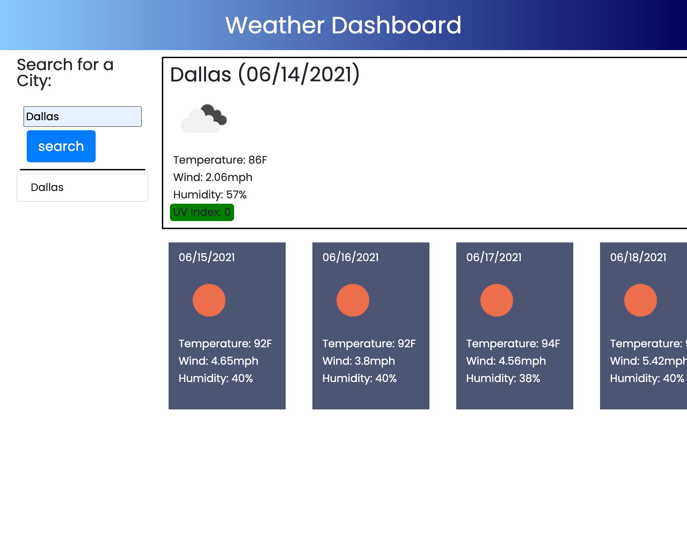

# Weather-Dashboard
  ## Table of Contents:
  * [Description](#Description)

  * [Website](#Website)

  * [Technologies-Used](#Languages-Used)

  * [License](#License)
  
  * [Contact](#Contact)
    
  
  ## Description:
    * This application was created using the Openweather one call API. I was to create an application that shows the weather for multiple cities: current and 5-day forecast. 

  ## Website:

  Deployed Site here: https://josejrrosas.github.io/Weather-Dashboard/
  

  
  ## Technologies-Used:
    * HTML
    * CSS
    * Javascript
    * Openweathermap API

  ## License:
    SMU bootcamp
  ## Contact: 
    * Name: Jose Rosas
    * Github: (https://github.com/josejrrosas)
    * Email : Josejrrosas@yahoo.com